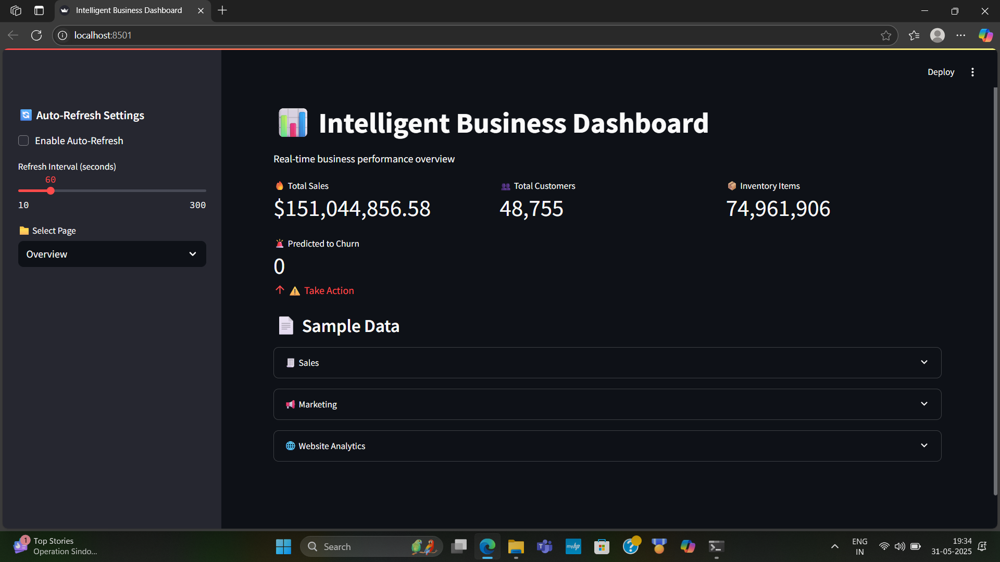
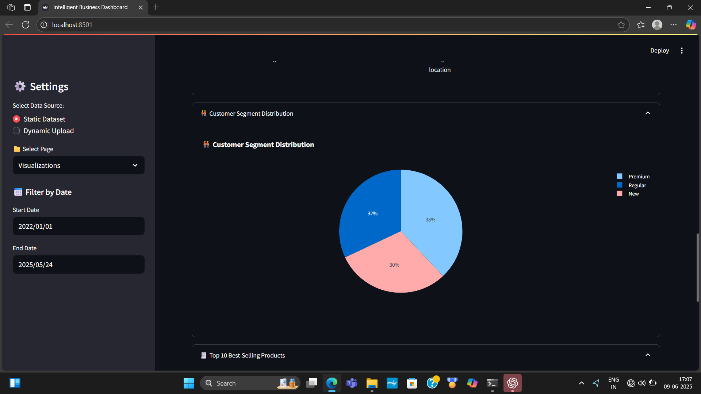
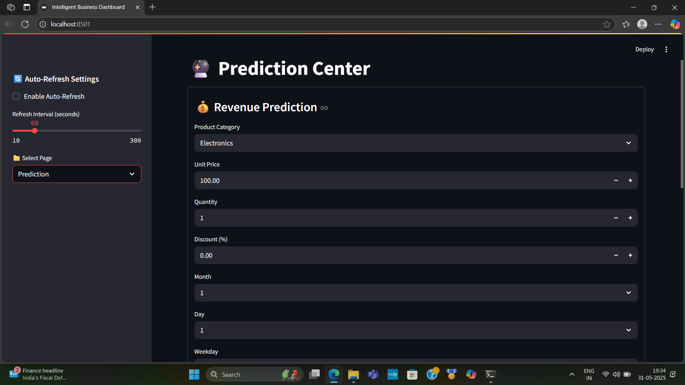

# Intelligent Business Dashboard with Predictive Analytics

## Overview
This project is a real-time business analytics dashboard designed to support data-driven decision-making through predictive analytics and interactive visualizations.

The dashboard integrates multiple datasets including sales, marketing, customer, inventory, ecommerce, and website analytics data to provide actionable business insights.

---

## Problem Statement
Businesses often struggle to analyze large amounts of operational data efficiently and generate predictive insights for decision-making.

This project aims to:
- Centralize business analytics
- Provide interactive visualizations
- Predict future sales revenue
- Support business intelligence workflows

---

## Features
- Interactive business dashboard
- Sales revenue prediction
- Real-time analytics visualization
- Multi-dataset integration
- Filtering and drill-down analysis
- Predictive analytics system
- Streamlit-based UI

---

## Technologies Used
- Python
- Streamlit
- Machine Learning
- Scikit-learn
- Pandas
- NumPy
- Matplotlib
- Seaborn
- SQLite

---

## Machine Learning Approach
The project uses a Random Forest Regression model to predict sales revenue based on business and customer-related features.

The workflow includes:
- Data preprocessing
- Feature engineering
- Model training
- Model evaluation
- Predictive inference

---

## Results
- Achieved R² score of 0.89 for revenue prediction
- Improved business analytics workflow
- Integrated 7 heterogeneous datasets
- Reduced dashboard loading time using caching and optimized processing

---

## Screenshots

### Dashboard Home


### Analytics Visualization


### Prediction Results


---

## Demo Video
Add your YouTube demo link here.

---

## Future Improvements
- Real-time cloud database integration
- Advanced forecasting models
- Customer churn prediction
- Automated reporting system
- Live API integration

---

## Installation

```bash
git clone https://github.com/your-username/business-dashboard-predictive-analytics.git
cd business-dashboard-predictive-analytics

pip install -r requirements.txt
```

---

## Run the Project

```bash
streamlit run app.py
```

---

## Author
Surya Yedugani

AI & Machine Learning Engineer
